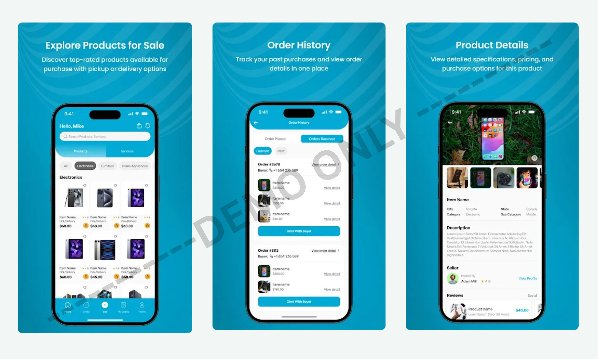
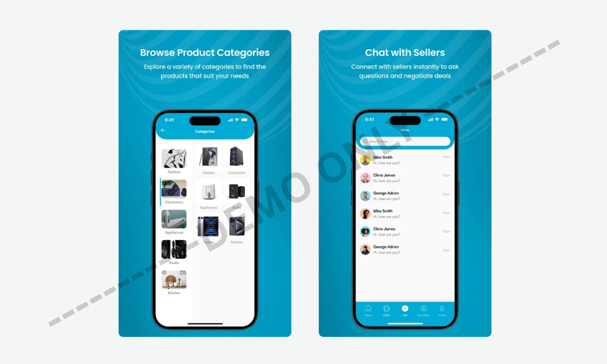

# 🛍️ Market Toll (For Demo Use Only)
### Industrial Portfolio — UI Showcase  
**Note:** This application belongs to **Market Toll**, developed during my time at **Launch Box** (Night Shift).  
This repository is created **only for demo and presentation purposes** to showcase UI work, feature integrations, and contributions.

---

## 📌 About the App

**Market Toll** is a modern e-commerce mobile application similar to OLX, where **buyers and sellers can interact, post ads, explore listings, and purchase items** within the app.

The app enables:

- 🛍️ Browsing and listing items  
- 💬 Buyer–seller interactions  
- 📦 Category-based product navigation  
- 💳 Secure in-app payments via Stripe  
- 🛒 A seamless marketplace experience  

This demo repository contains **no production code or backend logic** — only **visual previews** for interview and portfolio purposes.

---

## 👨‍💻 My Role & Contributions

While working with **Launch Box**, I worked extensively on this project:

- 🎨 **Designed all screens from scratch**  
- 🏗️ **Structured and built the complete app UI flow**  
- 💳 **Integrated Stripe payment gateway**  
- 👥 **Mentored and guided junior developers** on architecture & best practices  
- 🛠️ **Resolved UI bugs and improved experience consistency**  
- 🔧 Ensured smooth navigation and modular screen development  

This portfolio highlights the **design system, UI architecture, and major integrations** I contributed to.

---

## 🧩 Demo Assets Included  

This repository contains **only the following items**:

- ✔ App Icon  
- ✔ Two landscape showcase strips (displaying multiple screens)  
- ❌ No source code  
- ❌ No backend logic  
- ❌ No proprietary files  

Everything is provided **strictly for visual demonstration**.

---

## 🖼️ Visual Preview

### **App Icon**

---

### **Showcase — Landscape Preview 1**

---

### **Showcase — Landscape Preview 2**

---

## 📥 Download (Official Links)

> Note: This link belongs to the **official Market Toll app**, not this portfolio demo.

**Google Play:**  
[Available on Play Store](https://play.google.com/store/apps/details?id=com.dignitestudios.markettoll&hl=en) 

**App Store:**  
N/A (Android-only release)

---

## 📄 Disclaimer

This repository is **not affiliated with, endorsed by, or officially representing Market Toll, Launch Box, or any associated parties**.  
It is intended **solely to demonstrate my UI development and integration work**.  
All rights to the original application belong to **Market Toll**.

---

## 📬 Contact

For professional work, collaborations, or UI development:

**Email:** hamzabilalgaya.bilal@gmail.com  
**LinkedIn:** https://www.linkedin.com/in/hamza-bilal-g-4259a8181  
**Fiverr:** https://www.fiverr.com/s/EgZdxBK  
**Upwork:** https://www.upwork.com/freelancers/~01474d05eaa4a6e38b

---

## ⭐ Support My Work

If you like my work and want to support future UI components, tutorials, and open source:

### ☕ **Buy Me a Coffee**  

